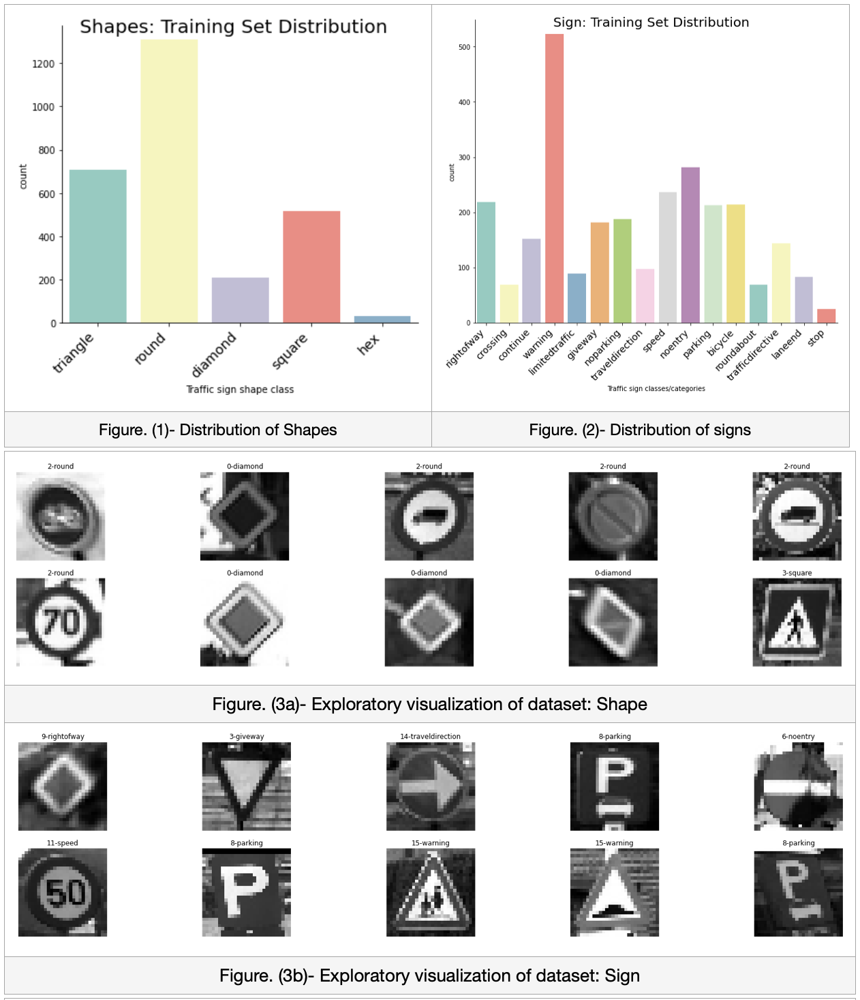
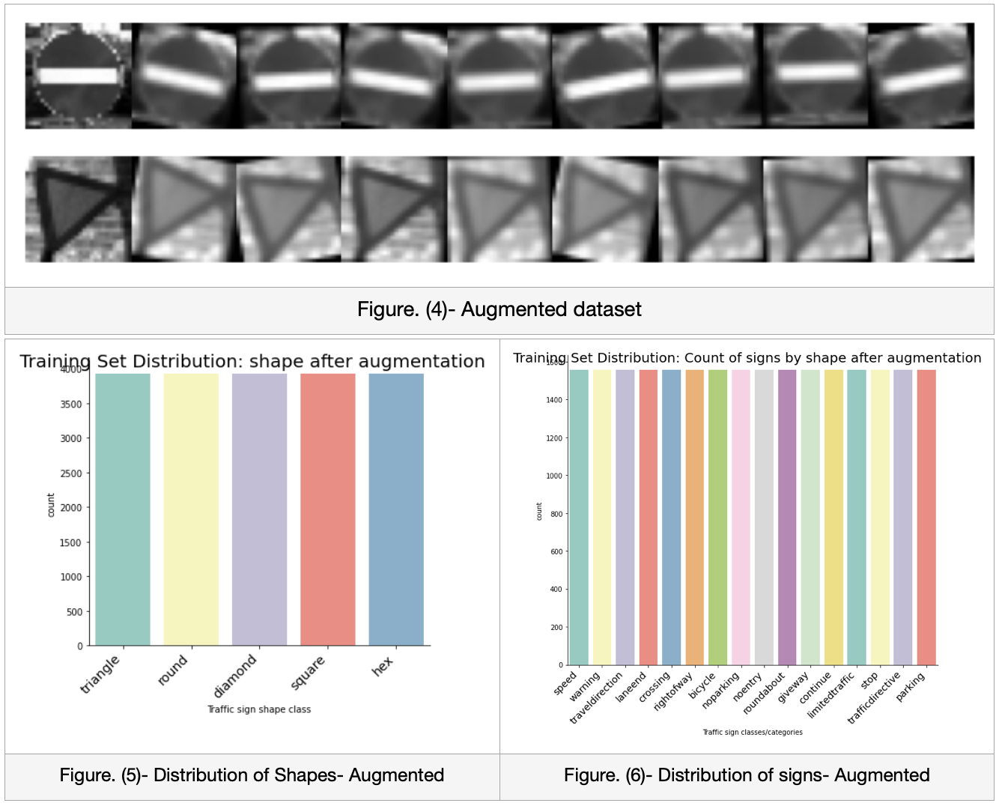
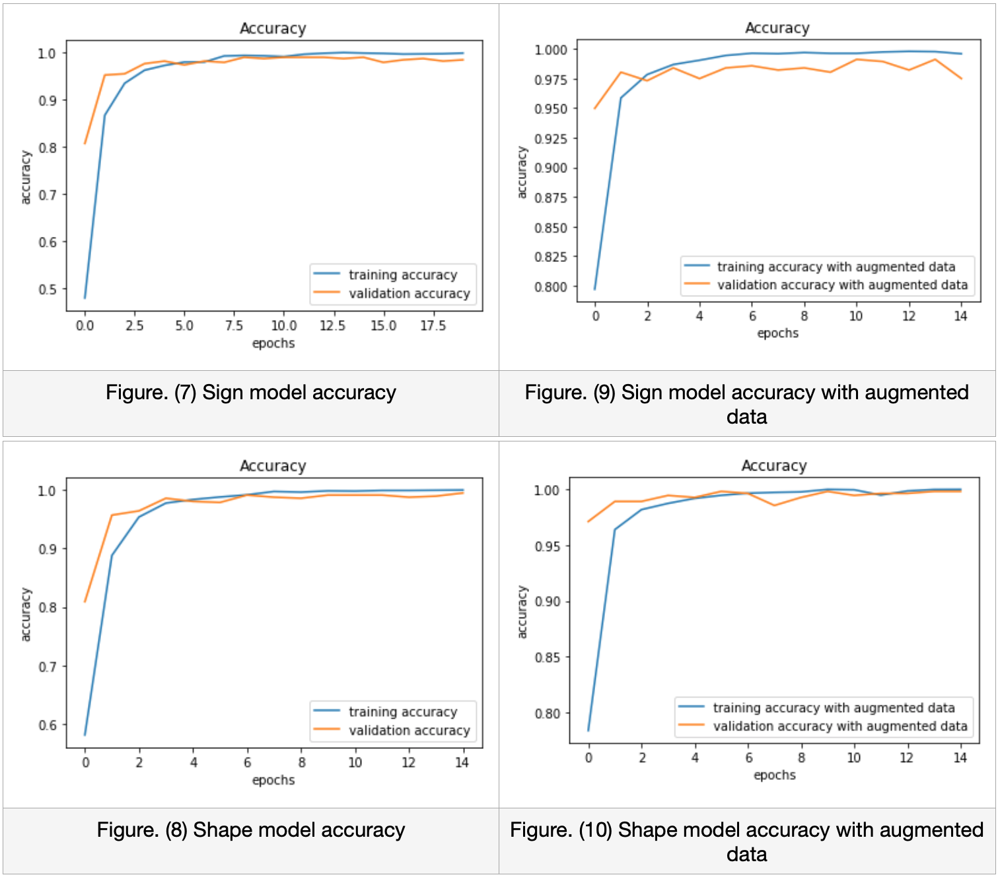

# Classification of Shapes and Sign of Traffic Sign using Deep Learning

Refer the following two notebooks for implementation

1. [Traffic sign shapes classifier](https://github.com/parekhjigar/Traffic-sign-classifier-cnn/blob/master/Traffic_sign_classification.ipynb)

2. [Traffic sign classifier](https://github.com/parekhjigar/Traffic-sign-classifier-cnn/blob/master/Traffic_sign_classification.ipynb)

## Abstract
The purpose of this project is to build two highly robust classification models, one of which is capable to classify the road traffic signs and the other is capable to classify the shapes of the traffic signs using deep learning. The models are implemented using Convolutional neural network (CNN) and are similar to AlexNet. The dataset used is a subset of Belgium Traffic Sign Classification Benchmark. Both the models gave validation and test accuracy above 98%.

## Introduction
The dawn of self-driving cars has began and it has a potential to revolutionize the way people travel by remarkably improving the level of safety along with great convenience and efficiency. The self-driving cars are generally distinguished by five levels of automation wherein the level-1 requires the driver’s assistance while the level-5 provides a completely autonomous experience. Although, it is a very crucial aspect to achieve the ability of full autonomy in public roads, the most essential aspect is to perceive the surrounding environment visually and by sensors like LiDAR and radar. So, the fundamental goal of the perception pipeline is to detect and recognise the traffic signs and act upon it accordingly.
The recognition of traffic signs is considered to be a very important feature of a self-driving car. If any substantial information of the traffic sign is not acknowledged by the driver, it may cause to an accident. However, these enhancements are certainly beneficial, but there are several technical challenges faced such as variation in lighting, change in weather, or any rotations or obstacles. Hence, there is a need of building highly accurate classification models which are robust to the problems that are addressed. (Saadna and Behloul, 2017)

## Data Exploration
1. **Loading the dataset:**
The dataset is a subset of Belgium Traffic Sign Classification Benchmark. Its resolution has been downsampled to 28x28 pixels to make dimensions of dataset consistent. Firstly, the original directory structure has been modified manually for training both the models. The root directory has the folders of signs for training to sign classifier and the root directory has the folders of shapes for the shape classifier. Now, I appended the images and labels to an array using the PIL library that copied all the image content into an array named “training_data”. Although the provided images were already grayscale, but their shape had 3 channels, so I converted its channel to 1.

2. **Pickle Data:**
Pickling data is basically to serialize and deserialize any python objects to byte streams. Here, I'm pickling the training_data list so that I can unpick the byte stream whenever required. The google colab kernel clears all the data and variables each time it is restarted and the data needs to be loaded to memory every time which is very time consuming. Saving all the raw pixel data of the sign images in a 4D array named “feature.pickle" and "feature-shape.pickle" which consists of (No. of images, width, height, colour channels). Saving index of categories(shape and sign) that maps to each images in a 1D array named “labels.pickle" and “labels-shape.pickle”. So, by unpicking this data, we get the images data in the form of numpy arrays and can perform operations on it easily.

3. **Normalization:**
Data normalization is very essential step while building an image classifier. It is performed to make sure that each input pixel has a similar distribution of data. Moreover, it is ideally better to have all the images with same aspect ratio. As I want all the pixel numbers to be positive so I scaled it between the range 0 to 255 by dividing every image data by 255. This will further make the convergence faster while training the network.

4. **Splitting data:**
The Training set is used to train the actual model. 75% of the data is used for training. The Validation set is used to give us biased evaluation of the trained model. 15% of data is used for validation. The Test set is unseen by the model while training, so it is used for the final evaluation of the model. 10% data is used for testing. This splitting of data is performed using train_test_split of sklearn library.

5. **Distribution of data:**
By plotting the distribution graphs, it is clearly visible that the dataset is very unbalanced across all the classes in the training set for both the models. Considering the sign model, the category of sign “stop” has only 43 images meanwhile the category of sign “warning” has 695 images. On the other hand, the category of shape “hex” has only 43 images meanwhile the category “round” has 1760 images. This may certainly lead our model to make biased decisions towards the classes which have more data, hence over-fitting the model. So, to evaluate this, I have chose to train models first with this distribution itself, and later perform data augmentation and train another set of model and compare between the two.

## Data Augmentation:
It is a technique which helps us to increase the number of samples in our dataset as well as balance the dataset virtually by adding various geometric transformations, changes in colour channels by adjusting the brightness and contrast. So here I applied various transformations to the images randomly like scaling the image using a random scaling factor between .9 and 1.1, converting the image with a random amount between -2 and 2 pixels in both the x-axis and y-axis, rotating the image using a random angle between -15 and 15 degrees. Moreover, using this approach, I generated 10 images for 16 categories to perform the individual evaluation of the sign model as no images were available for all the categories online. To make the evaluation robust, I used different transformations like flipping the image horizontally, applying shear on edges and changing the contrast.

## Model Architecture of CNN
I have followed a basic approach to build the convolutional neural network by configuring the number of layers and filter sizes. Starting with the input layer, the images with input shape 28x28 with a channel 1 which corresponds to grayscale is put into the model. Then a convolution with 64 feature detectors is added with the feature map size of 3x3 as the image data has very low resolution. Here padding didn’t add any difference so discarded it from the final model. ReLU is used as the activation function mainly because it clips the negative values and keeps the positive values unchanged increasing the non-linearity of the model. ReLUs usually train several times faster than their equivalent tanh units according to the statistical demonstration made by the authors of Alexnet. (Krizhevsky, Sutskever and Hinton, 2012). After this, Max pooling layer with stride size= 2 is applied which helps to reduce the spatial size to reduce the computation and parameters in the network. Now, one more layer of each is added again and flatten output is passed on to two fully connected layers. Tried L2 regularization and batch normalization but it didn’t improve the performance so I discarded it from the final model. Instead of using dropout, I considered replacing it with dense layers which pools the global average, it improved the performance along with reducing the model size. Then softmax is used to convert the output to the corresponding classes. This model is first fitted to the original dataset and then the exact same layers are added sequentially over this and fitted to the augmented dataset.
 
| Layer   | Description   | 
|---|---|
| Input  | 28x28x1 images  |
| Convolution 3x3  | feature detectors= 64, feature map= 3x3  |
| ReLU  |  Activation function |
| Max Pooling  | Stride size= 2x2  |
| Convolution 3x3  | feature detectors= 64, feature map= 3x3  |
| ReLU  | Activation function  |
|  Max Pooling | Stride size= 2x2  |
|  Flatten |  Converting feature map to single column |
| Fully connected  | Dense layer  |
| ReLU  | Activation function  |
| Fully connected  | Dense layer  |
| SoftMax  | Activation function  |

 
## Evaluation Metrics

|   | Shape model  |  Sign Model |
|---|---|---|
| Train accuracy  | 99.96%  |  99.82% |
| Validation accuracy  | 99.46%  |  98.39% |
| Test accuracy  | 99.18%  | 98.38%  |

## Independent Evaluation

Firstly, the test accuracy of both sign and shape models were completely unexpected as it was trained under such unbalanced data with minimal configurations of CNN. As the distribution of data had huge difference between the classes, I expected that the model will overfit, but it performed very well on test dataset as well. Data Augmentation was performed thinking that balancing the data and having more training samples would improve the model’s performance, but it took double the layers to reach the accuracy of the model without augmentation.
	The independent evaluation of the shape model was performed using a subset of data from the German Traffic Sign dataset. The prediction of the model was quite accurate and it achieved an accuracy of 93.22% as shown in the figure. (12). The only incorrect prediction made by the model is that it detected the square images as triangle as it had a thick line at the diagonal making the model to think it was triangle. Meanwhile, there were no such square images with a line in the training set. The model would have performed even better if there were some appropriate data to test with.	
	There were lot of challenges faced during independent evaluation of sign model. It was hard to find 16 classes of sign images with the same shape, for instance the bicycle sign image of our dataset is round in shape, but there were bicycle sign with a different shape out there. As we don’t know what features does the CNN consider for training a particular sign. It might be considering the borders of the shape along with the bicycle logo, so the model won’t be able to classify it as a bicycle sign if has a different shape or features. So, to have a perfect evaluation of the model, it was necessary to have images of all 16 classes that the model is actually expecting. Hence, I augmented 10 samples of each classes manually which had transformations totally different to that made in the model, so that the image is completely new to the model. But, for the sign model although the test accuracy was 99.18%, it performed very poor with this new dataset and gave just 61.25% of accuracy.
	The figure. (11) shows the prediction of sign model, as you can see the predictions went wrong with the classes which has multiple types inside a single category, i.e. traffic-directive and travel-direction which made the model to perform poorly. This could be improved by having a single type of sign in a category.
	

## Conclusion
The project covers how deep learning can be used for classification of traffic signs and shapes by applying various pre-processing, regularization and data augmentation techniques on different CNN architectures.

